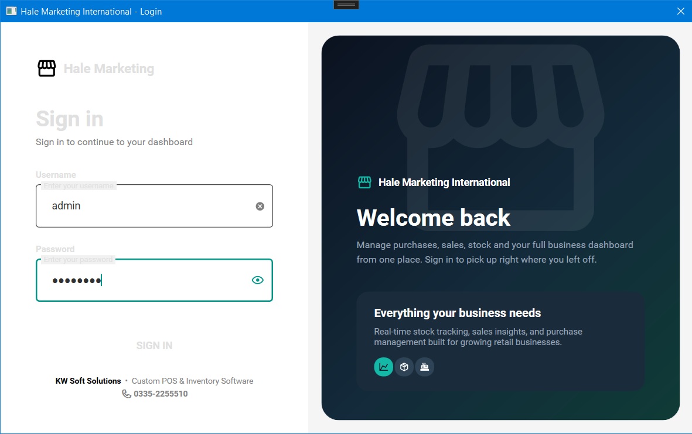
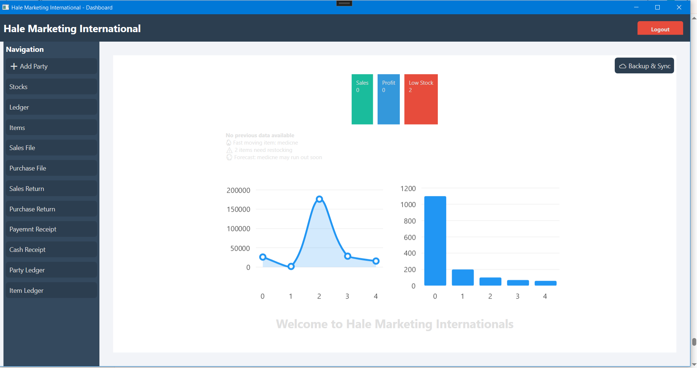
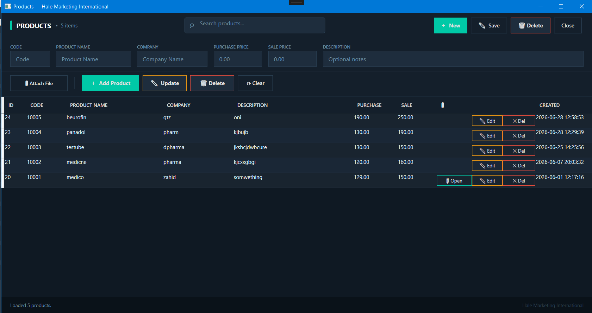
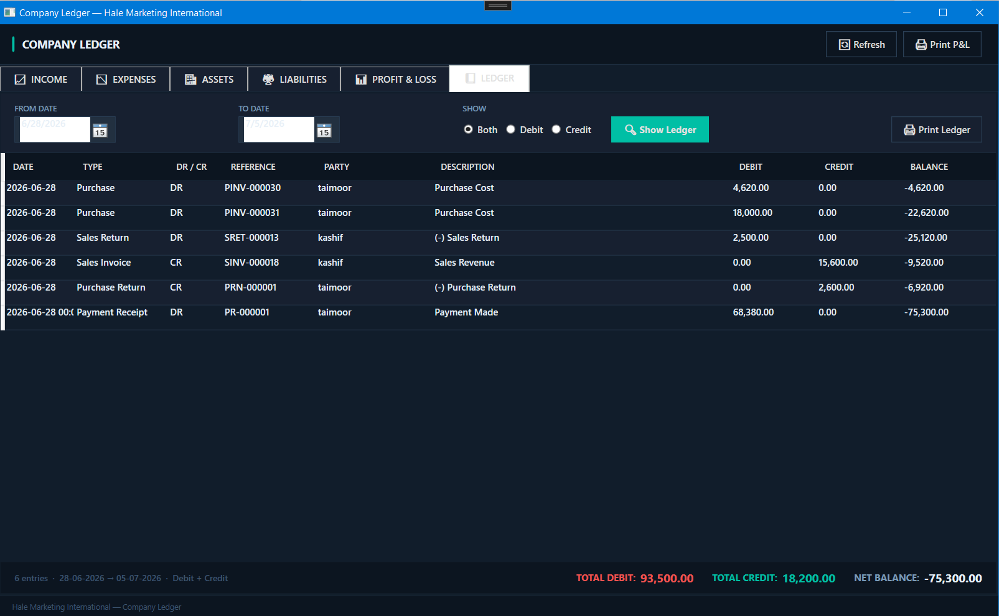
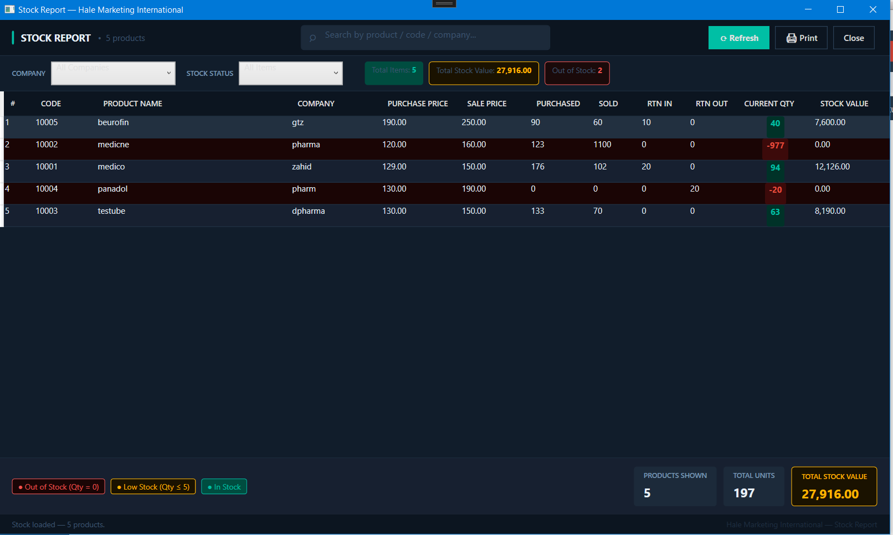
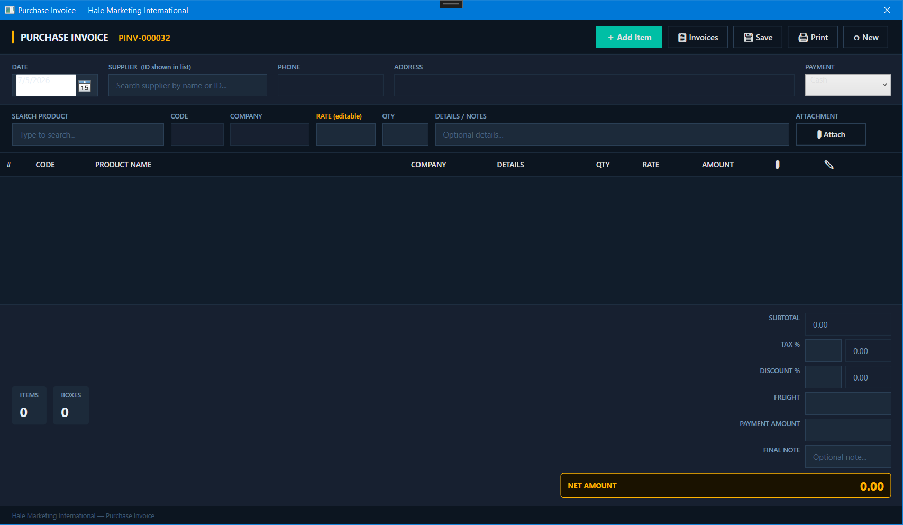
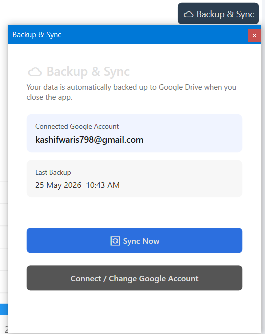

# 🛒 Hale Marketing International POS

A modern desktop Point of Sale (POS) application developed using **WPF (.NET)** for wholesalers and retail businesses. The system helps manage sales, purchases, inventory, ledgers, payments, and business reports through a clean and user-friendly interface.

---

# 📸 Application Screenshots

## Login


## Dashboard


## Products


## Ledger


## Stock Management


## Sales
![Sales]Screenshots/Sales.png)

## Purchase


## Backup & Recovery


---

# ✨ Features

- 🔐 Secure Login System
- 📊 Business Dashboard
- 📦 Product Management
- 📈 Stock Management
- 🛒 Sales Management
- 🛍 Purchase Management
- 🔄 Sales Return
- 🔄 Purchase Return
- 👥 Party Ledger
- 📒 Item Ledger
- 💵 Cash Receipt
- 💳 Payment Receipt
- 🔍 Search Functionality
- 🖨 Invoice Printing
- 📄 PDF Export
- 💾 Backup & Recovery

---

# 🛠 Technology Stack

- C#
- WPF
- .NET
- XAML
- MVVM
- SQLite
- Material Design
- LiveCharts

---

# 🚀 Getting Started

Clone the repository

```bash
git clone https://github.com/Kashifwa/hale-marketing-international-pos.git
```

Open the solution in Visual Studio 2022.

Build the project.

Run the application.

---

# 👨‍💻 Developer

**Kashif Waris**

BS Information Technology

Software Developer | WPF Desktop Developer | .NET Developer

GitHub:
https://github.com/Kashifwa

---

# ⭐ Support

If you like this project, don't forget to ⭐ the repository.
